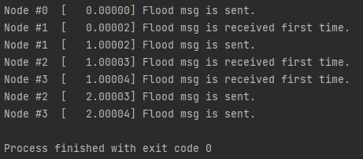
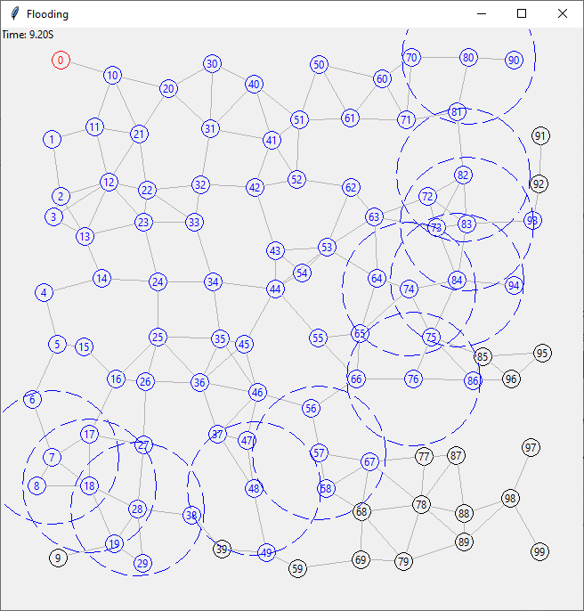
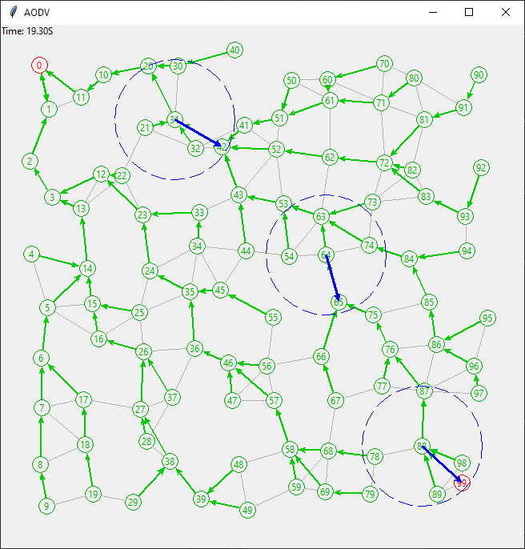

# DAWN-Sim
A Simple Distributed Algorithm Simulator for Research and Teaching. The simulator is based on WsnSimPy. It has also visualized version in it.

## Pre-requirements
Python version is 3.8

Install SimPy library

    pip install simpy

For graphical interface

    pip install tkinter

## Examples

There are three examples which are flood, flood_vis, and aodv. The flood and flood_vis examples simulate the flooding algorithm. The flood_vis is a visualized version of  the flood example.
The aodv simulates the AODV routing algorithm in the visualized version. Execute them via command line:

    python -m flood.py

    python -m flood_vis.py

    python -m aodv_vis.py

## How to use

**Step 1:** Import **`DawnSim`**.

    from source import DownSim

**Step 2:** Create a node class that inherits **`DawnSim.BaseNode`** to simulate a single node.

    class MyNode(DownSim.BaseNode):
        pass

**Step 3:** Override **`init()`**, **`run()`**, **`on_receive(pck)`**, and **`finish()`** functions (only the necessary ones).

    class MyNode(DownSim.BaseNode):
        def run():
            pck = {'var1': 'val1', 'var2', 'val2'}
            self.send(DawnSim.BROADCAST_ADDR, pck)

**Step 4:** Create a new **`DawnSim.Simulator`** object.

    my_sim = DawnSim(duration = 100)

**Step 5:** Add nodes into the simulator via **`add_node()`** function.

    my_sim.add_node(MyNode, pos = (50, 50), tx_range = 75)
    my_sim.add_node(MyNode, pos = (50, 100), tx_range = 75)

**Step 6:** Call the **`run()`** to start the simulation.

    my_sim.run()

## Citation

    Tosun, M., Cabuk, U. C., Dagdeviren, O., & Ozturk, Y. (2023, February). DAWN-Sim: A Distributed Algorithm Simulator for Wireless Ad-hoc Networks in Python. In 2023 International Conference on Computing, Networking and Communications (ICNC). IEEE.
